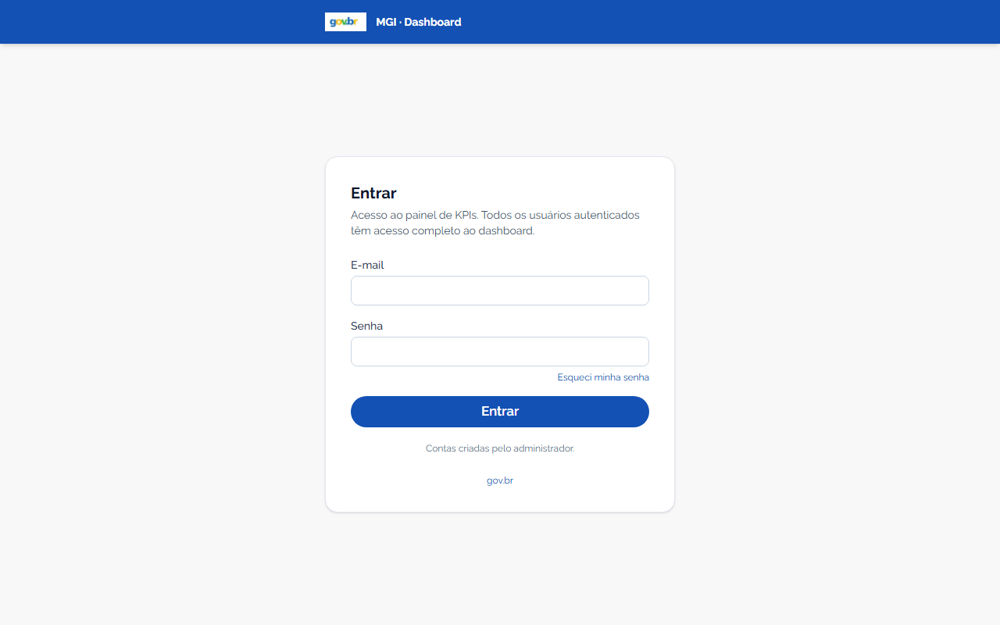

# MGI KPI Dashboard

Dashboard web para acompanhamento de KPIs, alertas e issues dos projetos MGI. Consome dados sincronizados do GitLab via [Supabase](https://supabase.com) (Postgres + RPCs) e faz parte do ecossistema MGI junto com o pipeline Python [`mgi-kpi-pipeline`](https://github.com/MariaHilmar/mgi-kpi-pipeline).

[](https://github.com/MariaHilmar/mgi-kpi-dashboard/actions/workflows/ci.yml)
[](https://sonarcloud.io/summary/new_code?id=MariaHilmar_mgi-kpi-dashboard)
[](LICENSE)
[](package.json)

**Demo:** [web-mgi-delog.vercel.app](https://web-mgi-delog.vercel.app) (acesso autenticado)



## Visão geral

```
GitLab (issues/commits)
        │
        ▼
mgi-kpi-pipeline  ──►  processamento em memória  ──►  sync_supabase.py
                                                              │
                                                              ▼
                                                         Supabase (Postgres)
                                                              │
                                                              ▼
                                                    mgi-kpi-dashboard (este repo)
```

O dashboard é **somente leitura**: não altera issues no GitLab. Ele consulta views e funções RPC no Supabase para montar gráficos, tabelas e KPIs com filtros globais compartilhados entre todas as páginas.

**Renderização:** Server Components no Next.js 16 — HTML gerado no servidor com streaming (`Suspense`) e cache de dados (`unstable_cache`, TTL 24 h). Skeletons durante navegação entre páginas.

## Funcionalidades

| Área | Rota | Descrição |
|------|------|-----------|
| Executivo | `/` | KPIs consolidados, evolução mensal, distribuição por status/tipo/módulo |
| Análise temporal | `/temporal` | Criados × fechados × backlog líquido por mês |
| Fluxo Kanban | `/fluxo` | CFD, throughput, lead time, WIP, gargalos e qualidade do histórico |
| Detalhamento | `/detalhamento` | Parceria, área funcional, lead time por módulo, KPI por tipo |
| Qualidade | `/qualidade` | Conformidade de preenchimento e backlog aberto |
| Alertas | `/alertas` | Sem épico/parceria, faixa de idade, maiores lead times |
| Sprint | `/sprint` | Visão focada no sprint selecionado nos filtros globais |
| Parcerias | `/parcerias` | Relatório mensal de demandas com label `Parceria::` |
| Equipes & Devs | `/equipes` | Volume por equipe, top desenvolvedores, merge em master |
| Analistas | `/analistas` | Relatório de atividades por analista (filtro por ID GitLab) |
| Issues | `/issues` | Busca livre, paginação, filtros (estado, SLA) e export Excel |
| Importar Dados | `/importar-dados` | Planning Poker — story points e campos de sprint (Excel/CSV) |
| Minha conta | `/conta` | Nome de exibição e alteração de senha |
| Admin usuários | `/admin/usuarios` | CRUD de contas (somente admin) |
| Login | `/login` | Entrada com e-mail e senha (Supabase Auth) |
| Cadastro | `/cadastro` | Criação de conta (opcional; desativável por env) |
| Recuperar senha | `/recuperar-senha` | Link por e-mail para redefinir senha |

**Autenticação:** rotas do dashboard exigem login. Papéis `admin` e `user`; área admin restrita. Issues são filtradas por analista via **`gitlab_user_id`** quando vinculado. Ver [docs/08-autenticacao.md](docs/08-autenticacao.md) e [docs/10-identidades-gitlab.md](docs/10-identidades-gitlab.md).

**Drill-down:** KPIs clicáveis (Total, Abertas, Fechadas, etc.) e contagens em gráficos/tabelas (`IssueCountLink`) levam para `/issues` em nova aba, preservando os filtros globais da URL.

**Tooltips contextuais:** ícones ℹ️ em títulos de seções explicam métricas e regras de cálculo (`InfoTooltip`, `CardSectionHeader`).

**Filtros globais:** módulo, área, tipo, prioridade, equipe, status, parceria, sprint, épico, repositório, ano e intervalos de datas — refletidos na query string e mantidos ao navegar entre páginas.

## Stack

- **Next.js 16** (App Router, Server Components, streaming com Suspense)
- **React 19** + **TypeScript**
- **Tailwind CSS 4** + [GovBR Design System](https://www.gov.br/ds/)
- **Recharts** — gráficos
- **Supabase** — backend de dados
- **Vitest** + Testing Library — testes unitários em `lib/` e `components/` (cobertura no CI)

## Pré-requisitos

- Node.js 20+
- Projeto Supabase configurado (schema + RPCs — ver `supabase/migrations/` neste repositório)
- Dados sincronizados pelo pipeline Python (`sync_supabase.py`)

## Configuração local

```powershell
git clone https://github.com/MariaHilmar/mgi-kpi-dashboard.git
cd mgi-kpi-dashboard
npm install
```

Crie `.env.local` a partir do exemplo:

```powershell
copy .env.local.example .env.local
```

Preencha as variáveis:

| Variável | Descrição |
|----------|-----------|
| `NEXT_PUBLIC_SUPABASE_URL` | URL do projeto Supabase |
| `NEXT_PUBLIC_SUPABASE_ANON_KEY` | Chave pública (anon) — usada no browser |
| `NEXT_PUBLIC_AUTH_REQUIRED` | (opcional) `false` desliga login em dev local |
| `NEXT_PUBLIC_ALLOW_SIGNUP` | (opcional) `false` desabilita `/cadastro` |

> Use apenas a **anon key** no frontend. A `service_role` fica exclusivamente no pipeline Python.

Inicie o servidor de desenvolvimento:

```powershell
npm run dev
```

Acesse [http://localhost:3000](http://localhost:3000).

Se as variáveis não estiverem configuradas, o dashboard exibe um banner de setup em vez de quebrar.

## Scripts

| Comando | Descrição |
|---------|-----------|
| `npm run dev` | Servidor de desenvolvimento (hot reload) |
| `npm run build` | Build de produção |
| `npm run start` | Servidor de produção (após `build`) |
| `npm run lint` | ESLint |
| `npm run test` | Testes unitários (Vitest) |
| `npm run test:watch` | Testes em modo watch |
| `npm run test:coverage` | Testes com relatório de cobertura |
| `npx tsc --noEmit` | Checagem de tipos TypeScript |

## Estrutura do projeto

```
mgi-kpi-dashboard/
├── app/
│   ├── layout.tsx              # Layout raiz (metadados, fontes)
│   ├── api/
│   │   ├── revalidate/         # Invalidação de cache (POST, Bearer token)
│   │   ├── reports/flow/       # APIs REST do relatório Kanban
│   │   ├── import/planning-poker/  # Importação Excel/CSV
│   │   ├── issues/export/      # Export Excel da listagem
│   │   └── parcerias/export/   # Export Excel de parcerias
│   └── (dashboard)/            # Páginas do dashboard (route group)
│       ├── layout.tsx          # Shell GovBR (Suspense, não bloqueante)
│       ├── loading.tsx         # Skeleton compartilhado
│       ├── page.tsx            # Executivo (streaming por seção)
│       ├── fluxo/
│       ├── parcerias/
│       ├── importar-dados/
│       ├── alertas/
│       ├── temporal/
│       ├── detalhamento/
│       ├── qualidade/
│       ├── sprint/
│       ├── equipes/
│       ├── issues/
│       └── analistas/
├── components/
│   ├── dashboard/              # KPIs, gráficos, tabelas, fluxo/
│   │   └── executivo/          # Seções async da página Executivo
│   ├── dados/                  # Painel de importação Planning Poker
│   ├── issues/                 # Listagem e busca de issues
│   ├── parcerias/              # Relatório de parcerias
│   └── layout/                 # Header GovBR, sidebar, filtros, skeletons
├── lib/
│   ├── dashboard/              # fetchers, cache, filters, flow-report, import
│   ├── format.ts               # Formatação pt-BR (número, data, %)
│   ├── navigation.ts           # Menu desktop + mobile
│   └── supabase/server.ts      # Cliente Supabase (server-only)
├── types/database.ts           # Tipos das RPCs e views
├── tests/                      # Vitest + Testing Library
├── vercel.json                 # Deploy Vercel (região gru1)
└── .github/workflows/ci.yml    # CI: lint, types, testes, audit
```

## CI/CD

A cada push ou pull request na branch `main`, o GitHub Actions executa:

1. `npm ci`
2. `npm run lint`
3. `npx tsc --noEmit`
4. `npm run test:coverage` (artefato `coverage-report` por 14 dias)
5. `npm audit --audit-level=high`

**SonarCloud:** análise automática ([projeto](https://sonarcloud.io/project/overview?id=MariaHilmar_mgi-kpi-dashboard)) via `.sonarcloud.properties`.

**Dependabot:** atualizações semanais de dependências npm e GitHub Actions.

Contribuições: veja [CONTRIBUTING.md](CONTRIBUTING.md). Segurança: [SECURITY.md](SECURITY.md). Limpeza de histórico: [docs/security-sanitize-git-history.md](docs/security-sanitize-git-history.md).

## Deploy (Vercel)

O projeto está preparado para deploy na [Vercel](https://vercel.com):

1. Conecte o repositório GitHub `MariaHilmar/mgi-kpi-dashboard`
2. Root Directory: raiz do repo (padrão)
3. Configure as variáveis de ambiente (`NEXT_PUBLIC_SUPABASE_*`, `REVALIDATE_SECRET`) no painel Vercel
4. Framework detectado automaticamente: **Next.js** (região `gru1` via `vercel.json`)
5. Deploy de **produção** apenas na branch `main` (`ignoreCommand` em `vercel.json`)

Deploy manual (CLI):

```powershell
npx vercel deploy --prod
```

## Repositórios relacionados

| Repositório | Papel |
|-------------|-------|
| [mgi-kpi-pipeline](https://github.com/MariaHilmar/mgi-kpi-pipeline) | Coleta GitLab, processamento em memória, sync Supabase |
| **mgi-kpi-dashboard** (este) | Visualização web dos KPIs |


