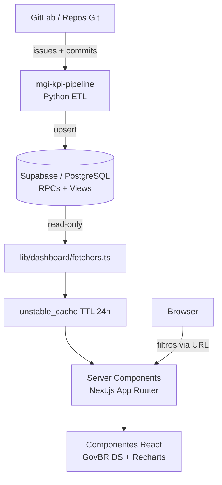

# MGI KPI Dashboard

[](https://github.com/MariaHilmar/mgi-kpi-dashboard/actions/workflows/ci.yml)
[](https://sonarcloud.io/summary/new_code?id=MariaHilmar_mgi-kpi-dashboard)


[](LICENSE)

Dashboard web para acompanhamento de **KPIs, alertas e fluxos de engenharia**. Full-stack com Next.js 16, Supabase e GovBR Design System, integrado ao pipeline Python [`mgi-kpi-pipeline`](https://github.com/MariaHilmar/mgi-kpi-pipeline).

> **Aviso legal:** projeto de **portfólio pessoal** de [Maria Hilmar](https://github.com/MariaHilmar). Reflete uma arquitetura inspirada em necessidades reais de monitoramento de equipes (GitLab, sprints, módulos). **Não é um sistema oficial do MGI** nem produto institucional. Não contém dados sensíveis, tokens ou credenciais versionados.

**Demo:** [web-mgi-delog.vercel.app](https://web-mgi-delog.vercel.app) (acesso autenticado)


---

## Visão geral

Dashboard Full-Stack desenvolvido para **visualizar métricas complexas de engenharia de software**, integrando-se ao [MGI KPI Pipeline](https://github.com/MariaHilmar/mgi-kpi-pipeline). A solução utiliza tecnologias modernas de web para entregar alta performance, cache inteligente e uma experiência de usuário alinhada ao **GovBR Design System**.

O dashboard é **somente leitura** em relação ao GitLab: não altera issues na origem. Consulta views e funções RPC no Supabase para montar gráficos, tabelas e KPIs com filtros globais compartilhados entre todas as páginas.

---

## Destaques técnicos

- **Server Components + Streaming** — HTML gerado no servidor com `Suspense` e skeletons durante navegação
- **Cache de dados** — `unstable_cache` com TTL de 24 h para navegação fluida entre páginas
- **Arquitetura em camadas** — separação clara entre fetchers (`lib/dashboard/`), cache e componentes de UI
- **Regras no banco** — RPCs PostgreSQL centralizam agregações; o frontend foca em visualização
- **UX contextual** — filtros globais sincronizados via URL, tooltips informativos e drill-down em KPIs
- **GovBR Design System** — identidade visual alinhada a padrões de acessibilidade governamental
- **Vitest + Testing Library** — **358 testes** unitários e de componente (59 arquivos de teste)
- **GitHub Actions + SonarCloud** — lint, tipos, testes e análise de qualidade a cada push/PR

---

## Arquitetura



### Camadas do sistema

1. **Backend (Pipeline)** — processamento em Python, ETL e carga no Supabase (`sync_supabase.py`).
2. **Data Layer** — PostgreSQL com funções RPC que centralizam regras de negócio e agregações, garantindo que o dashboard seja somente leitura e altamente estável.
3. **Frontend (Next.js)** — aplicação server-side focada em performance e UX, com Server Components, streaming e cache.

> **Nota de design — por que RPCs no banco?**
> As agregações pesadas (KPIs executivos, fluxo Kanban, throughput, lead time) rodam como
> **funções RPC no PostgreSQL**, não no frontend. A escolha é deliberada:
> - **Estabilidade** — o dashboard é somente leitura; regras de cálculo não duplicam entre Python e React.
> - **Performance** — o Postgres executa agregações com índices otimizados; o Next.js só renderiza.
> - **Testabilidade** — fetchers e componentes são testados isoladamente (358 testes); RPCs têm contrato versionado em `supabase/migrations/`.

---

## Stack

| Camada | Tecnologia |
|--------|------------|
| Frontend | Next.js 16 (App Router), React 19, TypeScript |
| UI / Estilo | Tailwind CSS 4, GovBR Design System |
| Visualização | Recharts (gráficos interativos) |
| Backend / Dados | Supabase (PostgreSQL + RPCs) |
| Testes | Vitest + Testing Library (358 testes) |
| Qualidade | ESLint, TypeScript, SonarCloud |
| CI/CD | GitHub Actions (lint, tsc, testes, cobertura) |
| Deploy | Vercel (`gru1`, Linux serverless) |

---

## Funcionalidades

### Analítico

| Rota | Descrição |
|------|-----------|
| `/` | KPIs executivos, evolução mensal, distribuição por status/tipo/módulo |
| `/temporal` | Criados × fechados × backlog líquido por mês |
| `/fluxo` | CFD, throughput, lead time, WIP, gargalos e qualidade do histórico |
| `/detalhamento` | Parceria, área funcional, lead time por módulo, KPI por tipo |
| `/qualidade` | Conformidade de preenchimento e backlog aberto |
| `/alertas` | Sem épico/parceria, faixa de idade, maiores lead times |

### Operacional

| Rota | Descrição |
|------|-----------|
| `/sprint` | Visão focada no sprint selecionado nos filtros globais |
| `/parcerias` | Relatório mensal de demandas com label `Parceria::` |
| `/equipes` | Volume por equipe, top desenvolvedores, merge em master |
| `/analistas` | Relatório de atividades por analista (filtro por ID GitLab) |
| `/issues` | Busca livre, paginação, filtros (estado, SLA) e export Excel |

### Gestão

| Rota | Descrição |
|------|-----------|
| `/importar-dados` | Planning Poker — story points e campos de sprint (Excel/CSV) |
| `/admin/usuarios` | CRUD de contas (somente admin) |
| `/conta` | Nome de exibição e alteração de senha |

**Autenticação:** rotas do dashboard exigem login (Supabase Auth). Papéis `admin` e `user`; área admin restrita. Issues filtradas por analista via `gitlab_user_id` quando vinculado. Ver [docs/08-autenticacao.md](docs/08-autenticacao.md).

**Drill-down:** KPIs clicáveis e contagens em gráficos/tabelas levam para `/issues` em nova aba, preservando filtros globais da URL.

**Filtros globais:** módulo, área, tipo, prioridade, equipe, status, parceria, sprint, épico, repositório, ano e intervalos de datas — refletidos na query string e mantidos ao navegar.

---

## Pré-requisitos

- Node.js **20+**
- Projeto Supabase configurado (schema + RPCs — ver `supabase/migrations/`)
- Dados sincronizados pelo [`mgi-kpi-pipeline`](https://github.com/MariaHilmar/mgi-kpi-pipeline)

> O CI usa `ubuntu-latest` (padrão GitHub Actions). A produção roda na Vercel (Linux serverless). Desenvolvimento local funciona em Windows + PowerShell sem WSL.

---

## Configuração e execução

```powershell
git clone https://github.com/MariaHilmar/mgi-kpi-dashboard.git
cd mgi-kpi-dashboard

npm install
copy .env.local.example .env.local
```

Preencha as variáveis em `.env.local`:

| Variável | Descrição |
|----------|-----------|
| `NEXT_PUBLIC_SUPABASE_URL` | URL do projeto Supabase |
| `NEXT_PUBLIC_SUPABASE_ANON_KEY` | Chave pública (anon) — usada no browser |
| `NEXT_PUBLIC_AUTH_REQUIRED` | (opcional) `false` desliga login em dev local |
| `NEXT_PUBLIC_ALLOW_SIGNUP` | (opcional) `false` desabilita `/cadastro` |

> Use apenas a **anon key** no frontend. A `service_role` fica exclusivamente no pipeline Python.

### Comandos

```bash
npm run dev          # Servidor local (http://localhost:3000)
npm run build        # Build de produção
npm run test         # Testes unitários (Vitest — 358 testes)
npm run test:coverage # Testes com relatório de cobertura
npm run lint         # ESLint
npx tsc --noEmit     # Checagem de tipos TypeScript
```

Se as variáveis não estiverem configuradas, o dashboard exibe um banner de setup em vez de quebrar.

---

## Qualidade de software

O projeto segue padrões de nível corporativo com integração contínua no **GitHub Actions**, validando lint, tipos (TypeScript) e testes a cada push na branch `main`. Análise adicional via **SonarCloud**. Ver [CONTRIBUTING.md](CONTRIBUTING.md).

---

## Estrutura do projeto

```
mgi-kpi-dashboard/
├── app/
│   ├── (dashboard)/            # Páginas do dashboard (route group)
│   └── api/                    # Revalidate, import, export, reports
├── components/
│   ├── dashboard/              # KPIs, gráficos, tabelas, milestone
│   ├── dados/                  # Importação Planning Poker
│   ├── issues/                 # Listagem e busca
│   └── layout/                 # Header GovBR, sidebar, filtros
├── lib/dashboard/              # fetchers, cache, filters, import
├── tests/                      # Vitest + Testing Library (358 testes)
├── supabase/migrations/        # Schema Postgres e RPCs
└── .github/workflows/ci.yml    # CI: lint, tsc, testes, cobertura
```

Documentação detalhada: [docs/README.md](docs/README.md).

---

## Deploy (Vercel)

1. Conecte o repositório GitHub `MariaHilmar/mgi-kpi-dashboard`
2. Configure as variáveis de ambiente (`NEXT_PUBLIC_SUPABASE_*`, `REVALIDATE_SECRET`)
3. Framework: **Next.js** (região `gru1` via `vercel.json`)
4. Deploy de produção apenas na branch `main`

---

## Repositórios relacionados

| Repositório | Papel |
|-------------|-------|
| [mgi-kpi-pipeline](https://github.com/MariaHilmar/mgi-kpi-pipeline) | Coleta GitLab, processamento em memória, sync Supabase |
| **mgi-kpi-dashboard** (este) | Visualização web dos KPIs — portfólio |

---

## Licença

Este projeto está licenciado sob a Licença MIT — veja o arquivo [LICENSE](LICENSE) para detalhes.
