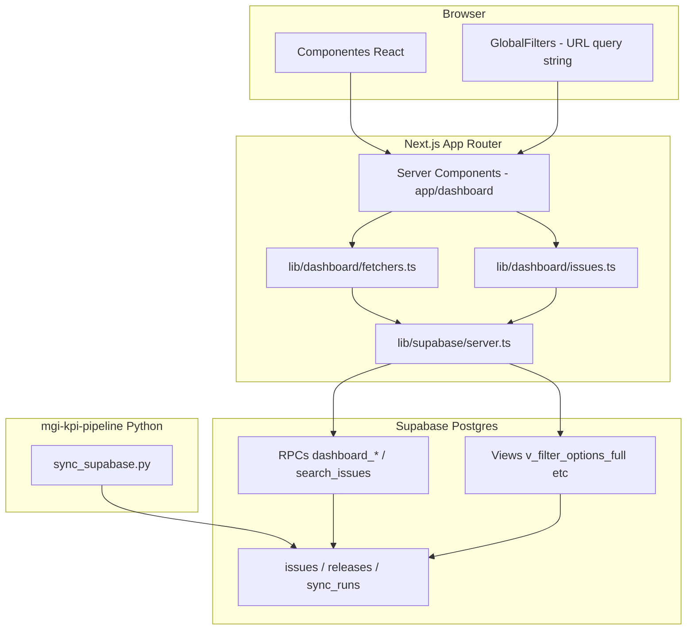

# Arquitetura

## Stack tecnológica

| Camada | Tecnologia | Versão (package.json) |
|--------|------------|-------------------------|
| Framework | Next.js (App Router) | 16.2.9 |
| UI | React | 19.2.4 |
| Linguagem | TypeScript | 5.x |
| Estilo | Tailwind CSS | 4.x |
| Design System | GovBR DS (`@govbr-ds/core`) | 3.7.0 |
| Gráficos | Recharts | 3.9.x |
| Backend de dados | Supabase (Postgres + RPCs) | `@supabase/supabase-js` 2.108.x |
| Testes | Vitest + Testing Library | ~87% cobertura |
| CI | GitHub Actions | Node 20 |
| Deploy | Vercel | detecta Next.js automaticamente |

## Diagrama de camadas



## Estrutura de diretórios

```
mgi-kpi-dashboard/
├── app/
│   ├── layout.tsx                 # Layout raiz (fontes, metadados)
│   └── (dashboard)/               # Route group — URLs sem prefixo
│       ├── layout.tsx             # Header, sidebar, filtros, footer
│       ├── page.tsx               # / Executivo
│       ├── alertas/
│       ├── temporal/
│       ├── detalhamento/
│       ├── qualidade/
│       ├── sprint/
│       ├── equipes/
│       └── issues/
├── components/
│   ├── dashboard/                 # KPIs, gráficos, tabelas de alerta
│   ├── issues/                    # Toolbar, tabela, paginação
│   └── layout/                    # GovBR header/footer, sidebar, filtros
├── lib/
│   ├── dashboard/
│   │   ├── constants.ts           # TODOS, TOP_LIMIT, dimensões RPC
│   │   ├── fetchers.ts            # Chamadas Supabase (RPCs/views)
│   │   ├── filters.ts             # parseFilters, commonArgs, dateArgs
│   │   ├── issues.ts              # searchIssues → RPC search_issues
│   │   └── page.ts                # getDashboardContext (boilerplate)
│   ├── format.ts                  # Formatação pt-BR
│   ├── navigation.ts              # NAV_GROUPS (sidebar + mobile)
│   └── supabase/server.ts         # Cliente server-only
├── types/database.ts              # Tipos TypeScript do domínio
├── tests/                         # Vitest
├── supabase/migrations/           # (no workspace pai) schema versionado
└── docs/                          # Esta documentação
```

## Padrões de implementação

### Server Components por padrão

Todas as páginas do dashboard são **async Server Components**. Dados são buscados no servidor via `fetchers.ts` antes do HTML ser enviado ao cliente.

Exceções client-side (`"use client"`):

- `KpiGrid` — drill-down preservando query string;
- `GlobalFilters` — interação com filtros na URL;
- componentes de gráfico que dependem de Recharts no browser.

### Filtros via URL (single source of truth)

Os filtros globais são serializados na **query string** (`?modulo=X&sprint=Y&...`). Ao navegar entre páginas, os parâmetros persistem. A função `parseFilters()` em `lib/dashboard/filters.ts` normaliza os valores; `commonArgs()` e `dateArgs()` traduzem para parâmetros das RPCs Postgres.

Valor sentinela **`Todos`** = sem filtro na dimensão correspondente.

### Acesso ao Supabase

```typescript
// lib/supabase/server.ts
createServerSupabase()  // retorna null se env vars ausentes
isSupabaseConfigured()  // guard usado por SetupBanner
```

Se as variáveis `NEXT_PUBLIC_SUPABASE_*` não estiverem definidas, o dashboard exibe `SetupBanner` em vez de falhar.

### Tratamento de erros

Fetchers registram erros no console (`console.error`) e retornam arrays vazios ou `null` — a UI degrada graciosamente (cards vazios, mensagem de KPIs indisponíveis).

## Integração com o pipeline

| Responsabilidade | Componente |
|------------------|------------|
| Coleta issues GitLab | `atualizar_gitlab_issues.py` |
| Coleta Git (commits, releases) | `coleta_git_contratos.py` |
| Processamento em memória | `processar_issues_memoria.py`, `issue_fields.py`, `taxonomy.py` |
| Upsert Postgres | `sync_supabase.py` |
| Registro de execução | tabela `sync_runs` |
| Leitura | este dashboard (RPCs) |

Migrations SQL ficam em `D:\mgi-workspace\supabase\migrations\` (001–007). Devem ser aplicadas no projeto Supabase antes do primeiro sync.

## Segurança

- Frontend usa apenas **anon key** com políticas RLS/grants definidas nas migrations `002`, `006`, `007`.
- Nenhum secret de `service_role` no código ou env público do Next.js.
- Dashboard não expõe endpoints de escrita — somente SELECT/RPC de leitura.

## CI/CD

**GitHub Actions** (`.github/workflows/ci.yml`):

1. `npm ci`
2. `npx tsc --noEmit`
3. `npm run test`

**Vercel:** `vercel.json` define framework Next.js; env vars configuradas no painel Vercel.
