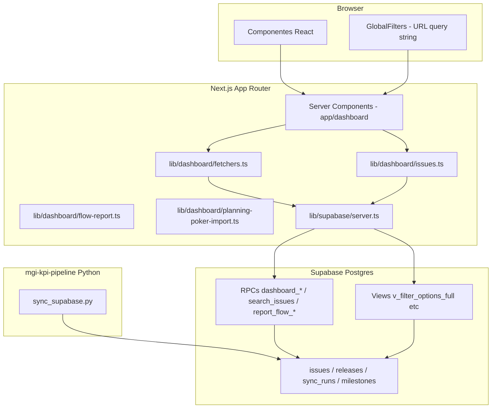
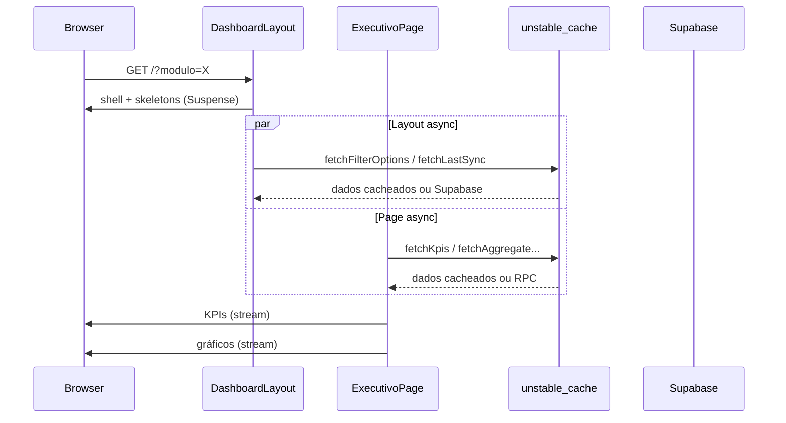

# Arquitetura

## Stack tecnológica

| Camada | Tecnologia | Versão (package.json) |
|--------|------------|-------------------------|
| Framework | Next.js (App Router) | 16.2.9 |
| UI | React | 19.2.4 |
| Linguagem | TypeScript | 5.x |
| Estilo | Tailwind CSS | 4.x |
| Design System | GovBR DS (`@govbr-ds/core`) | 3.7.0 |
| Gráficos | Recharts | 3.9.x |
| Backend de dados | Supabase (Postgres + RPCs) | `@supabase/supabase-js` 2.108.x |
| Testes | Vitest + Testing Library | ~87% cobertura |
| CI | GitHub Actions | Node 20 |
| Deploy | Vercel | detecta Next.js; produção apenas na branch `main` |
| Qualidade de código | SonarCloud | análise automática (`.sonarcloud.properties`) |

## Diagrama de camadas



## Estrutura de diretórios

```
mgi-kpi-dashboard/
├── app/
│   ├── layout.tsx                 # Layout raiz (fontes, metadados)
│   ├── api/
│   │   ├── revalidate/            # POST — invalidação cache (tag kpis)
│   │   ├── reports/flow/          # GET — APIs REST relatório Kanban
│   │   ├── import/planning-poker/ # POST/GET — importação Excel/CSV
│   │   ├── issues/export/         # GET — export Excel de issues
│   │   ├── parcerias/export/      # GET — export Excel de parcerias
│   │   ├── analistas/export/      # GET — export Excel/Word analistas
│   │   └── admin/users/           # CRUD usuários (service role)
│   └── (dashboard)/               # Route group — URLs sem prefixo
│       ├── layout.tsx             # Shell GovBR (Suspense + streaming)
│       ├── loading.tsx            # Skeleton compartilhado entre rotas
│       ├── page.tsx               # / Executivo (streaming por seção)
│       ├── fluxo/
│       │   └── loading.tsx
│       ├── parcerias/
│       │   └── loading.tsx
│       ├── importar-dados/
│       ├── alertas/
│       │   └── loading.tsx
│       ├── temporal/
│       │   └── loading.tsx
│       ├── detalhamento/
│       │   └── loading.tsx
│       ├── qualidade/
│       │   └── loading.tsx
│       ├── sprint/
│       │   └── loading.tsx
│       ├── equipes/
│       │   └── loading.tsx
│       ├── issues/
│       │   └── loading.tsx
│       └── analistas/
│           └── loading.tsx
├── components/
│   ├── dashboard/                 # KPIs, gráficos, tabelas, fluxo/
│   │   └── executivo/             # Seções async da página Executivo
│   ├── dados/                     # ImportarDadosPanel
│   ├── issues/                    # Toolbar, tabela, paginação, badges
│   ├── parcerias/                 # Toolbar e tabela de parcerias
│   ├── ui/                        # InfoTooltip, Button, SortableTh
│   └── layout/                    # GovBR header/footer, sidebar, filtros
│       ├── DashboardLayoutParts.tsx  # Wrappers async do layout
│       ├── ConditionalGlobalFilters.tsx  # Oculta filtros em /parcerias e /importar-dados
│       └── DashboardPageLoading.tsx  # Skeleton de navegação
├── lib/
│   ├── dashboard/
│   │   ├── cache.ts               # cachedFetch + tag kpis (TTL 24 h)
│   │   ├── constants.ts           # TODOS, TOP_LIMIT, dimensões RPC
│   │   ├── fetchers.ts            # Chamadas Supabase (RPCs/views)
│   │   ├── filters.ts             # parseFilters, commonArgs, dateArgs
│   │   ├── flow-report.ts         # RPCs relatório Kanban
│   │   ├── flow-stages.ts         # Mapeamento etapas Kanban
│   │   ├── planning-poker-import.ts  # Parser e upsert Excel/CSV
│   │   ├── parcerias.ts           # fetchParceriasIssues
│   │   ├── issues.ts              # searchIssues → RPC search_issues
│   │   ├── issuesLinks.ts         # URLs drill-down para /issues
│   │   └── page.ts                # getDashboardContext (boilerplate)
│   ├── format.ts                  # Formatação pt-BR
│   ├── navigation.ts              # NAV_GROUPS (sidebar + mobile)
│   └── supabase/server.ts         # Cliente server-only
├── assets/chart-fonts/            # DejaVu Sans TTF (exports Word/Excel)
├── types/database.ts              # Tipos TypeScript do domínio
├── tests/                         # Vitest
├── supabase/migrations/           # Schema versionado (001–035)
└── docs/                          # Esta documentação
```

## Padrões de implementação

### Server Components por padrão

Todas as páginas do dashboard são **async Server Components**. Dados são buscados no servidor via `fetchers.ts` e enviados ao cliente como HTML + payload RSC.

Exceções client-side (`"use client"`):

- `KpiGrid` — drill-down preservando query string;
- `GlobalFilters` — interação com filtros na URL;
- `InfoTooltip` / `CardSectionHeader` — tooltips contextuais em títulos de seção;
- `IssueCountLink` — contagens clicáveis com drill-down para `/issues`;
- componentes de gráfico que dependem de Recharts no browser.

### Renderização e performance

O dashboard usa **SSR dinâmico com streaming** — não há SSG nem cache de página inteira. Cada request renderiza no servidor, mas o HTML é enviado progressivamente conforme os blocos ficam prontos.



**Camadas de otimização:**

| Camada | Mecanismo | Efeito |
|--------|-----------|--------|
| Cache de dados | `cachedFetch` + `unstable_cache` (tag `kpis`, TTL 24 h) | Evita RPC repetido entre requests |
| Layout não bloqueante | `Suspense` + wrappers async em `DashboardLayoutParts.tsx` | `{children}` renderiza em paralelo com header/filtros |
| Navegação | `loading.tsx` por rota + `DashboardPageLoading` | Skeleton imediato ao trocar de página |
| Página Executivo | Seções async (`KpiSection`, `FluxoMensalSection`, etc.) | KPIs e gráficos aparecem independentemente |

**Dinamismo sem `force-dynamic`:** páginas com `searchParams` (filtros na URL) e rotas que leem cookies (auth) já são dinâmicas no Next.js 16. Não é necessário `export const dynamic = "force-dynamic"`.

**Invalidação de cache:** após cada sync bem-sucedido, o pipeline chama `POST /api/revalidate` com `Authorization: Bearer <REVALIDATE_SECRET>`, que executa `revalidateTag("kpis")`.

### Cache de dados (`lib/dashboard/cache.ts`)

Fetchers de KPI, agregações, opções de filtro e última sync usam `cachedFetch`:

```typescript
// lib/dashboard/cache.ts
export const CACHE_TAG_KPIS = "kpis";
const CACHE_TTL_SECONDS = 86_400; // 24 h
```

| Fetcher | Chave de cache |
|---------|----------------|
| `fetchKpis`, `fetchAggregate`, `fetchFluxoMensal`, etc. | por dimensão + filtros serializados |
| `fetchFilterOptions` | `filter-options` |
| `fetchLastSync` | `last-sync` |

Fetchers cacheados usam `createStaticSupabase()` (cliente anon **sem cookies**). Auth e perfil continuam com `createServerSupabase()` fora do cache.

### Filtros via URL (single source of truth)

Os filtros globais são serializados na **query string** (`?modulo=X&sprint=Y&...`). Ao navegar entre páginas, os parâmetros persistem. A função `parseFilters()` em `lib/dashboard/filters.ts` normaliza os valores; `commonArgs()` e `dateArgs()` traduzem para parâmetros das RPCs Postgres.

Valor sentinela **`Todos`** = sem filtro na dimensão correspondente.

### Acesso ao Supabase

```typescript
// lib/supabase/server.ts
createStaticSupabase()   // anon sem cookies — fetchers cacheados (RPCs/views)
createServerSupabase()   // anon com cookies — auth, perfil, admin
isSupabaseConfigured()   // guard usado por SetupBanner
```

Se as variáveis `NEXT_PUBLIC_SUPABASE_*` não estiverem definidas, o dashboard exibe `SetupBanner` em vez de falhar.
### Tratamento de erros

Fetchers registram erros no console (`console.error`) e retornam arrays vazios ou `null` — a UI degrada graciosamente (cards vazios, mensagem de KPIs indisponíveis).

## Integração com o pipeline

| Responsabilidade | Componente |
|------------------|------------|
| Coleta issues GitLab | `atualizar_gitlab_issues.py` |
| Coleta Git (commits, releases) | `coleta_git_contratos.py` |
| Processamento em memória | `processar_issues_memoria.py`, `issue_fields.py`, `taxonomy.py` |
| Upsert Postgres | `sync_supabase.py` |
| Registro de execução | tabela `sync_runs` |
| Leitura | este dashboard (RPCs) |

Migrations SQL ficam em `supabase/migrations/` neste repositório (001–035). Devem ser aplicadas no projeto Supabase antes do primeiro sync.

## APIs REST internas

Além das RPCs Supabase, o dashboard expõe rotas Next.js autenticadas:

| Prefixo | Uso |
|---------|-----|
| `/api/reports/flow/*` | Relatório Kanban (CFD, throughput, lead time, etc.) — ver [11-relatorio-fluxo.md](./11-relatorio-fluxo.md) |
| `/api/import/planning-poker` | Importação Planning Poker — ver [12-importar-dados.md](./12-importar-dados.md) |
| `/api/issues/export` | Export Excel da listagem `/issues` |
| `/api/parcerias/export` | Export Excel do relatório `/parcerias` |
| `/api/analistas/export` | Export Excel/Word do relatório analistas |
| `/api/revalidate` | Invalidação de cache pós-sync (Bearer `REVALIDATE_SECRET`) |

## Segurança

- Frontend usa apenas **anon key** com políticas RLS/grants definidas nas migrations `002`, `006`, `007`.
- `SUPABASE_SERVICE_ROLE_KEY` no servidor (Vercel) — somente para admin de usuários e importação Planning Poker; nunca exposta ao browser.
- Endpoints de leitura não expõem escrita arbitrária; importação valida sessão e usa upsert controlado.

## CI/CD

**GitHub Actions** (`.github/workflows/ci.yml`):

1. `npm ci`
2. `npx tsc --noEmit`
3. `npm run test`

**Vercel:** `vercel.json` define framework Next.js, região `gru1` (São Paulo, alinhada ao Supabase `sa-east-1`) e `ignoreCommand` que limita deploy de produção à branch `main`. Env vars no painel Vercel.
